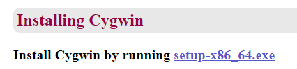
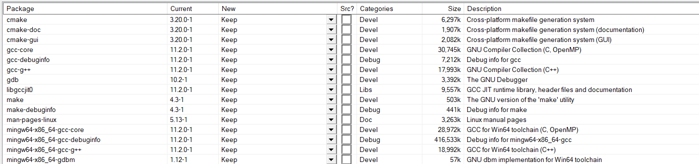
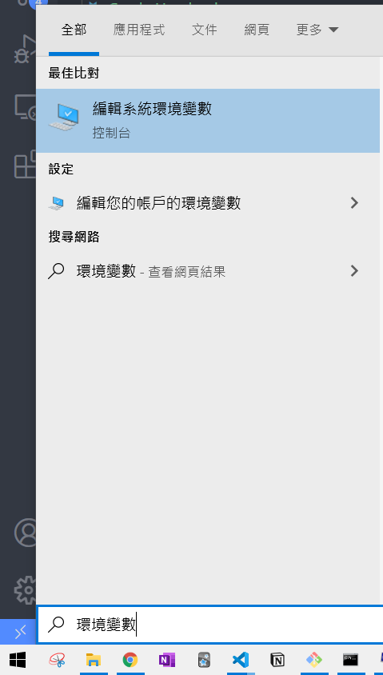
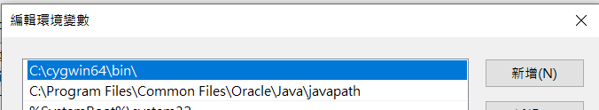
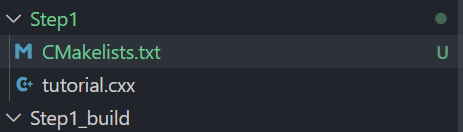

# Cmake 手把手教學

是因為想要學習使用 google test ，才發現需要先了解如何 build 一個大型專案，所以才在這邊寫下我的筆記的，希望讀者看完這邊可以具有以下這些技術

- [ ] 能用 cmake build 專案
- [ ] header或檔案沒有變動，就不要重新編譯，節省時間

## 環境建立

- Windows 10
- AMD Ryzen 5 4500U

由於大部分的東西都是UNIX 環境，所以在windows 上面運行的時候需要安裝一些額外的套件。

### (1) 安裝 cygwin

1. [下載 cygwin 官方網站](https://www.cygwin.com/)
  
1. 我裝了這些東西
  

### (2) 新增環境變數

1. 開始 -> 搜尋 "環境變數"
   
1. path 新增 `C:\cygwin64\bin\`
   

### 安裝名單

- cmake
- cmake-doc
- cmake-gui
- gcc-core
- gcc-debuginfo
- gcc-g++
- gdb
- libgccjit()
- make
- make debug info
- man-pages-linux

## 檔案與文件

> 參考官方網站上的教學

- 可以參考[官方文件](https://cmake.org/cmake/help/latest/guide/tutorial/index.html)
- 先把Cmake原始碼下載下來[官方git](https://github.com/Kitware/CMake/tree/master/Help/guide/tutorial)
- 這邊會有教學的檔案 CMake/Help/guide/tutorial/

## (1) 最簡單的 Cmakelists

- 在Step1 的資料夾裡面加上一個最簡單的 Cmakelists ，內容就三行，

```cmake
// 定義cmake最低的版本
cmake_minimum_required(VERSION 3.10)

// 定義這個 project 叫做 Tutorial
project(Tutorial)

// Tutorial 這個 project，可執行的檔案是tutorial.cxx
add_executable(Tutorial tutorial.cxx)
```

- 創立一個資料夾，叫做 Step1_build ，那現在的環境應該會長得像是這樣
  

- 移動到 Step1_build 之後下 cmake 指令，他會幫忙建立環境跟 makefile 的檔案

```commandline
cd Step1_build
cmake ../Step1
```

- 這個時候就可以真的做 complie
  輸入 `cmake --build .`
- 產生了一個叫做 Tutorial.exe 的檔案，這個檔案就是 Project 的名稱，如果你上面 CMakelists.txt 中的 Project 叫做 Hello 的話，那他就會產生 Hello 這個檔案
- 可以嘗試著輸入 `Tutorial 3` 他會幫你算3的平方根

## (1-1) 新增 版本號碼

在剛剛的CMakelists.txt ，把project名字設定那邊，多加上版本的資訊

```cmake
project(Tutorial VERSION 1.3)
```

接下來我們要想，怎麼把這個資訊傳送到 c file 裡面，我們的方法是建立一個 `TutorialConfig.h.in` header 檔案，裡面寫

```c
#define Tutorial_VERSION_MAJOR @Tutorial_VERSION_MAJOR@
#define Tutorial_VERSION_MINOR @Tutorial_VERSION_MINOR@
```

用兩個小老鼠(@) 包含住的詞語，會從 cmake 那邊拿取 project 的版本資訊這樣。所以就可以修改我們的 cfile，

```c
#include "TutorialConfig.h"
  if (argc < 2) {
    std::cout << argv[0] << " Version " << Tutorial_VERSION_MAJOR << "."
              << Tutorial_VERSION_MINOR << std::endl;
    std::cout << "Usage: " << argv[0] << " number" << std::endl;
    return 1;
  }
```

然後打指令 `make` 就可以 print 出現在的版本了

## (1-2) 定義 C 版本

在 project 下面可以直接定義你要的C的版本

```cmake
project(Tutorial VERSION 1.3)

set(CMAKE_CXX_STANDARD 11)
set(CMAKE_CXX_REQUIERE True)
```

## (2) 新增一個 Library

現在使用 Step2 這個資料夾，我們打算把 Step1 寫出來的功能作為 Library 來使用的感覺。

### 新增一個資料夾，把他 add_library

首先把想要的功能先放在一個資料夾，叫做 `MathFunctions` 在裡面新增一個`CMakelists.txt` 內容填寫這一行

```cmake
add_library(MathFunctions mysqrt.cxx)
```

### 在根目錄的 CMakelists 加上訊息

為了要能使用這個新的 libray ，我們需要定義這個專案需要新增一個子資料夾。把這個資料夾加到target 的 link 裡面。然後target需要

- add_subdirectory(MathFunctions)
- target_link_libraries(Tutorial PUBLIC MathFunctions)
- target_include_directories("${PROJECT_SOURCE_DIR}/MathFunctions")

```cmake
cmake_minimum_required(VERSION 3.10)

# set the project name and version
project(Tutorial VERSION 1.0)

# specify the C++ standard
set(CMAKE_CXX_STANDARD 11)
set(CMAKE_CXX_STANDARD_REQUIRED True)

# configure a header file to pass some of the CMake settings
# to the source code
configure_file(TutorialConfig.h.in TutorialConfig.h)

add_subdirectory(MathFunctions)
# add the executable
add_executable(Tutorial tutorial.cxx)

target_link_libraries(Tutorial PUBLIC MathFunctions)
# add the binary tree to the search path for include files
# so that we will find TutorialConfig.h
target_include_directories(Tutorial PUBLIC
                           "${PROJECT_BINARY_DIR}"
                           "${PROJECT_SOURCE_DIR}/MathFunctions"
                           )

```

### 把這個東西弄得更專業些

其實上面那個寫法就可以了，但是大型專案不是這樣寫的，所以我們就把他寫成一個有變數的版本

首先，先建立一個opition。
`option(USE_MYMATH "Use tutorial math implemention ~" ON)`

再來，cmake 會吃TutorialConfig.h.in 然後產生一個  `TutorialConfig.h`
`configure_file(TutorialConfig.h.in TutorialConfig.h)`

設定 USE_MYMATH 有被設定的話就做剛剛那三件事情，根剛剛不一樣的地方是，這邊用 list append的方法將檔案的地址來保存在 EXTRA_LIBS 跟 EXTRA_INCLUDES 裡面

```cmake
if(USE_MYMATH)
  add_subdirectory(MathFunctions)
  list(APPEND EXTRA_LIBS MathFunctions )
  list(APPEND EXTRA_INCLUDES "${PROJECT_SOURCE_DIR}/MathFunctions")
endif()
```

所以下面要改成這樣

```c
add_executable(Tutorial tutorial.cxx)

target_link_libraries(Tutorial PUBLIC ${EXTRA_LIBS})

# add the binary tree to the search path for include files
# so that we will find TutorialConfig.h
target_include_directories(Tutorial PUBLIC
                           "${PROJECT_BINARY_DIR}"
                           ${EXTRA_INCLUDES}
                           )
```

在 `TutorialConfig.h.in` 要加上 cmake 的設定

```c
// the configured options and settings for Tutorial
#define Tutorial_VERSION_MAJOR @Tutorial_VERSION_MAJOR@
#define Tutorial_VERSION_MINOR @Tutorial_VERSION_MINOR@
#cmakedefine USE_MYMATH

```

## (3) 加上一些 Library 的要求

加上一些 Library 的要求可以使我們更好的控制 target的那些關係，常用的指令有

- target_compile_definitions()
- target_compile_options()
- target_include_directories()
- target_link_libraries()

## 疑難雜症

### cygheap base mismatch detected - 0x180347408/0x180346408

這個就是 cygwin 跟 bash (git bash) 的版本有點衝突，所以沒辦法再 git bash 使用 make的功能

### Does not match the generator used previously

之前 cmake 的檔案跟你現在想要使用的 generator 不一樣，可以考慮把 cache刪掉之後再做一次

```error log
cmake ../Step1
CMake Error: Error: generator : Unix Makefiles
Does not match the generator used previously: NMake Makefiles
Either remove the CMakeCache.txt file and CMakeFiles directory or choose a different binary directory.
```

### make[2]: 警告：檢測到時鐘錯誤。您的構建版本可能是不完整的

就是時間跟cmake 的時間沒有對應上，我是系統的時間出現錯誤
