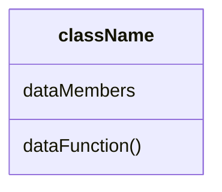
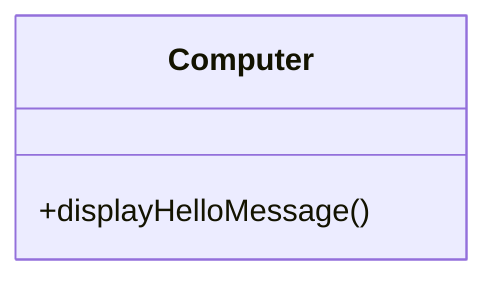

# C++

這邊文章的架構主要使用C++ primer，因為筆者有 C 相關的經驗，這邊就從架構上來看到底C跟C++ 的不同在哪裡，以及避免用C寫C++的尷尬情況。

## 架構

這本書分成四個部分

- 基礎
  - 控制流程用的 for/while 都跟 C 長的一樣
  - 輸入輸出的格式跟 C 不一樣，用 << 這種東西
- C++ 函式庫
- Tools for class authors
- 進階問題

## Cpp 輸入輸出

基本上 hello world 需要用到輸入輸出。這邊就看...

## Class 系列

這邊對應到螞蟻書第16章節。這邊終於要介紹，什麼叫做物件導向(object origented,OO)的程式要怎麼寫。通常，一個類別(Class)裡面會有資料成員跟函式，畫成圖案的話，大概會長得像是下面這個樣子。這個是一個常見的表示方式，叫做UML(統一塑模語言, Unified Modeling Language)，後面在學物件導向會常看到。就先記得一下吧。



```cpp
#include <iostream>

using namespace std;
class Computer {
 public:
  void displayHelloMessage() const { cout << "Hello Test" << endl; }
};

int main(int argc, char const *argv[]) {
  Computer myComputer;
  myComputer.displayHelloMessage();
  return 0;
}
```

上面這段程式碼，在主程式的地方，創造了一個 myComputer 物件。然後用加一個點的方式，可以使用這個物件的函式。大概就是這樣，有幾點需要幫忙注意

- class 的名稱一般來說都是大寫開頭，(Pascal case)。
- likeThisName 叫做駝峰式(camel hump)

> **常犯的錯誤**
> 忘記在class 定義後面加上分號。

**public是什麼?**
這個是一個存取修飾符號(access specifier)，上面那種寫法代表displayHelloMessage() 這個函式是可以給大眾使用的(available to the public)，也就是說其他的函式，可以呼叫這個物件裡面的函式。就像是上面那段程式裡面main()這個函式，可以呼叫myComputer裡面的公開函式一樣。

後面還有其他的存取修飾符號，像是 private, 跟 protected ，這個後面會提到。

**const寫在那邊是什麼意思?**
因為在顯示這段hello world 的時候，這個函式，不行，也不應該更該到這個物件裡面的其他內容。所以這段就是在告訴編譯器「這個函式不能修改物件的內容」，如果不幸修改到了，那就會有一個編譯時期上的錯誤會產生。這個可以讓你更快速的找到不小心寫錯的地方。

**一定要創造物件之後才可以用他的函式嗎?**
基本上是這樣，除非是 static member function。

**這題UML怎麼畫?**

這邊的+代表他是 public 的意思



**那要怎麼輸入input?**

```cpp
# include <iostream>
# include <string>

using namespace std;
class Computer {
 public:
  void displayHelloMessage(string s) const { cout << s << endl; }
};

int main(int argc, char const *argv[]) {
  Computer myComputer;
  string inputStr;
  inputStr = "Hello input";
  myComputer.displayHelloMessage(inputStr);
  return 0;
}
```

**string是什麼?**

這個要用之前記得先include <string> 這個函式庫，基本上他在標準函式庫裡面，也就是平常要用的話要使用`std::string` 這種使用方法

<https://blog.tinlans.org/2022/04/17/%E8%BF%91%E5%B9%B4%E5%B8%B8%E8%A2%AB%E5%95%8F%E5%88%B0%E5%A6%82%E4%BD%95%E5%AD%B8%E7%BF%92-c/>

## C 沒有的資料類別

### String

### Vector

### hash

unordered_map
