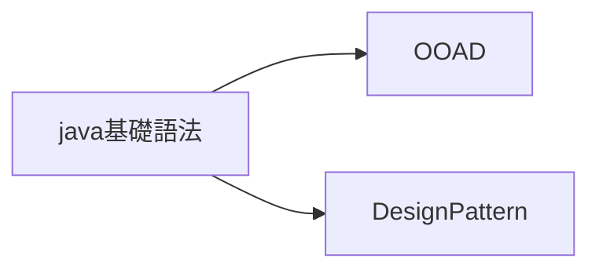
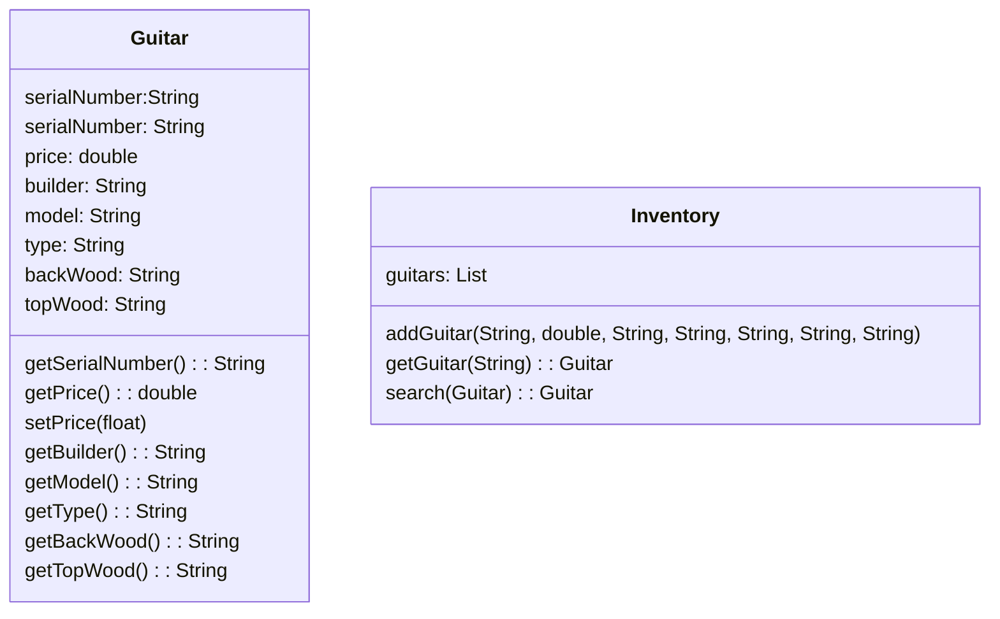

# Object Oriented Analysis & Desgin

## 心得

## 參考
<https://www.gushiciku.cn/pl/phav/zh-hk>

## 閱讀路線



## 簡介

這本書適合誰

- 可能需要一些Java的背景知識

## 第一章，設計不錯的程式真好

**要怎麼寫好程式?**
該怎麼下手就是一個很快難的問題了，想想看這個程式有沒有像你預計的一樣達成它的功能，想想這兩個重複的程式碼，竟然他重複了是不是就代表他有點問題，所以要怎麼下手就是個很困難的問題，尤其是你還要擔心你可能改了之後原來的功能就被你毀掉這樣事情。在當我們看完這一張，我們就可以知道怎麼寫一個好的程式碼，還有了解這本書的OOA&D 的概念是什麼。=

**吉他系統案例?**

Rick 決定要做一個用紙搭建的系統，去追蹤他的吉他們，畢竟他們有很多隻，我們現在要幫他做一個app管理他的吉他。

大概我們需要這樣設計



當我們要增加吉他的時候，就要輸入各種資料，例如序號阿，價錢阿，誰做的阿，什麼型態的吉他阿，他的前版木板是什麼材質，後面的木版是什麼材質之類的，依造上面的UML設計圖，我們應該可以設計成這樣子的程式。我下面用 C++ 改寫

```Cpp
 
```
